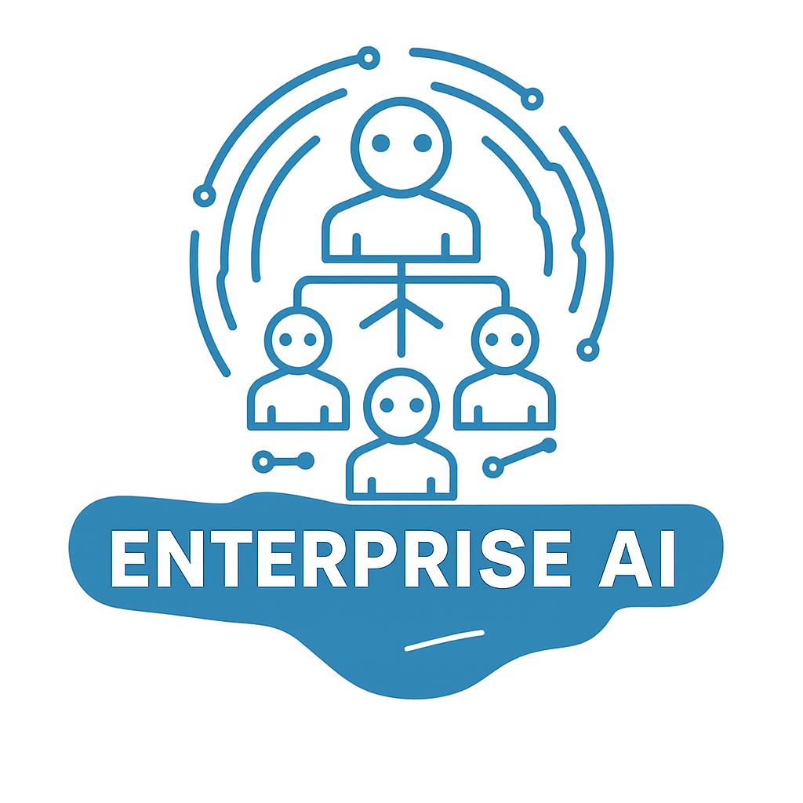

<p align="center">
  
</p>

<h1 align="center">Enterprise AI</h1>

<p align="center">
  <b>Python SDK for autonomous multi-agent workflows</b><br>
  <i>Build agents that work like a real team — planning, executing, collaborating</i>
</p>

<p align="center">
  
  
  
  
</p>

---

## Vision

Enterprise AI is a **Python SDK** that turns an LLM into a fully autonomous agent — capable of planning, invoking tools, and delivering results with minimal oversight.

The quality bar is explicit: **one Enterprise AI agent = one complete mono-run of a production-grade agentic runtime**. That means a proper multi-turn loop, parallel tool orchestration, a full permission pipeline, streaming events, and sandboxed execution.

Beyond the single agent, the real differentiator is **teams**: multiple agents with defined roles (Manager, Developer, Researcher) that coordinate on a shared mission, delegate tasks, and share memory — like a real human team.

No LangChain. No framework lock-in. Built from scratch, minimal dependencies, exact pins.

---

## Core Architecture

### Agent — the execution unit

Each agent runs a complete agentic loop:

```
prompt → [AssembleContext → LLM → tool_calls → Orchestrate → results → LLM] → output
```

The orchestrator batches tool calls: independent calls run concurrently (`asyncio.gather`), context-modifying calls run sequentially. Every tool call passes through a 12-step pipeline: resolve, validate, backfill, pre-hooks, safety check, permissions, call, post-hooks, format, size limit, context modifier.

### Permission pipeline

Three modes — `onRequest` (ask for sensitive calls), `auto` (allow within deny rules), `bypass` (for scripts). Deny rules and safety checks are bypass-immune.

### Providers

Unified interface over Anthropic, OpenAI, OpenRouter, Ollama. Uses the `openai` SDK as a universal client for all OpenAI-compatible endpoints; native `anthropic` SDK for Anthropic models.

### Tools

Every tool implements a typed `BaseTool` contract: name, description, Pydantic input schema, `async call()`. Built-in tools: BashTool, FileEditor, WebSearch, CodeSearch, Terminate.

### Sandbox

Isolated execution for dangerous tools. Docker-backed (ephemeral container, volume mount, CPU/memory limits) or local (strict timeout, process group kill). A `SandboxManager` handles lifecycle across multiple agents.

### Teams

```python
team = Team([
    Agent(role="manager"),
    Agent(role="developer"),
    Agent(role="researcher"),
])
result = await team.run("Build a REST API for user management")
```

Each team member is a **full agent** with its own tools, sandbox, and memory. Coordination happens through shared tools (task board, mailbox) — emergent, not orchestrated top-down.

---

## Quick Start

```python
import asyncio
from enterprise_ai import Agent
from enterprise_ai.tools import BashTool, FileEditor, WebSearch
from enterprise_ai.providers import AnthropicProvider

async def main():
    agent = Agent(
        role="developer",
        tools=[BashTool(), FileEditor(), WebSearch()],
        provider=AnthropicProvider(model="claude-opus-4-8"),
    )

    # Single run
    result = await agent.run("Fix the failing test in tests/auth_test.py")
    print(result.output)

    # Streaming
    async for event in agent.stream("Refactor the auth module to use JWT"):
        print(event)

asyncio.run(main())
```

```python
# Multi-agent team
from enterprise_ai import Agent, Team

async def main():
    team = Team([
        Agent(role="manager"),
        Agent(role="developer"),
        Agent(role="researcher"),
    ])
    result = await team.run("Research best practices and implement OAuth2 login")
    print(result.output)
```

---

## Package Structure

```
enterprise_ai/
├── schema/          # Message, ToolCall, ToolResult, StreamEvent — zero internal deps
├── providers/       # Anthropic, OpenAI, OpenRouter, Ollama
├── tools/           # BaseTool contract, ToolRegistry, built-in tools
├── execution/       # Orchestrator — parallel/serial batching, 12-step pipeline
├── permissions/     # Deny rules, safety checker, permission pipeline
├── engine/          # Query loop, state machine, context compaction
├── sandbox/         # DockerSandbox, LocalSandbox, SandboxManager, AsyncTerminal
├── agent/           # Agent class, AgentRole, AgentConfig
├── team/            # Team class, inter-agent communication, task delegation
├── memory/          # SessionMemory, LongTermMemory (SQLite)
└── config/          # Settings, environment
```

**Dependency order** (no cycles): `schema` ← `providers`, `tools`, `sandbox` ← `permissions`, `execution` ← `engine` ← `agent` ← `team`

---

## Development Status

### Phase 1 — Core agent ✅
- [x] Schema layer (Message, ToolCall, StreamEvent, Session)
- [x] Provider abstraction + Anthropic, OpenAI, OpenRouter, Ollama
- [x] Tool contract + registry + 5 built-in tools (bash, file_editor, web_search, code_search, terminate)
- [x] Execution orchestrator (parallel/serial batching, 12-step pipeline)
- [x] Permission pipeline (3 modes, bypass-immune safety check, denial tracking)
- [x] Engine query loop + state machine + context compaction
- [x] Sandbox — LocalSandbox (timeout, process group kill, blocked patterns) + DockerSandbox (ephemeral container, mem/cpu limits) + SandboxManager
- [x] Memory — SessionMemory (sliding window)
- [x] 46 unit tests — permissions, orchestrator, memory, sandbox · ruff + mypy clean

### Phase 2 — Teams (next)
- [ ] Mailbox — shared async message bus between agents
- [ ] TaskBoard — shared task queue (post, claim, complete)
- [ ] Team class — persistent parallel agent sessions
- [ ] Sub-agent spawning from within an agent (one-shot delegation)
- [ ] Built-in skills: manager, developer, researcher, planner

### Phase 3 — Ecosystem
- [ ] Skill system (YAML/Python portable skills)
- [ ] MCP client integration
- [ ] Extended tool library (Browser, Document, Image)
- [ ] Long-term memory (SQLite cross-session)
- [ ] Optional HTTP API server

### Phase 4 — Open source ready
- [ ] Test coverage > 70%
- [ ] Full documentation + cookbook
- [ ] v0.1.0 public release

---

## Contributing

Enterprise AI is in active development. Contributions, issues, and discussions are welcome once the v0.1.0 core is stable.

## License

MIT — see [LICENSE](LICENSE).

---

<p align="center">
  <i>Enterprise AI is the open-source Python expression of the Nexus agentic vision.</i>
</p>
