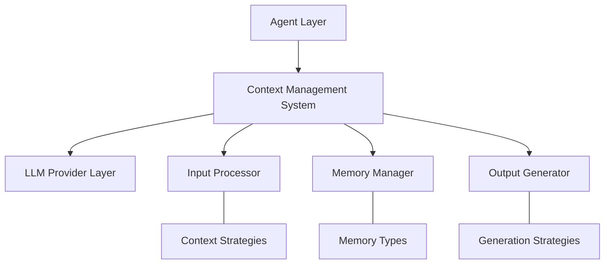
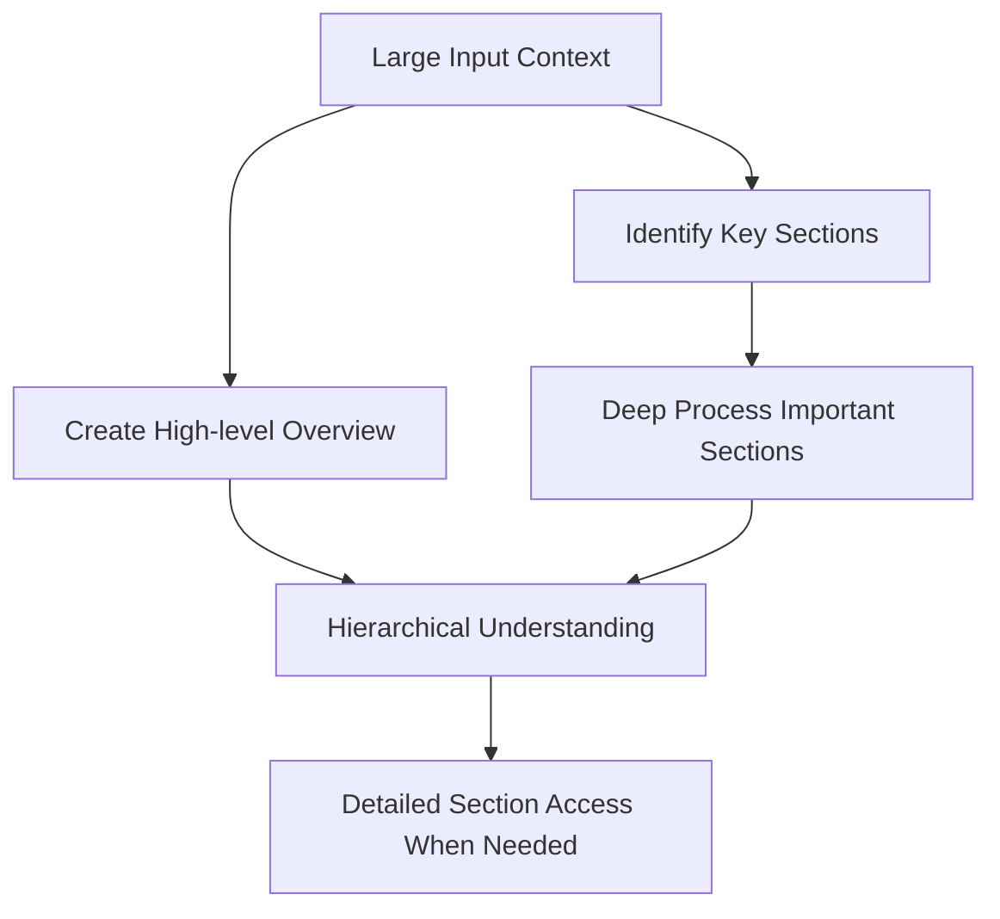
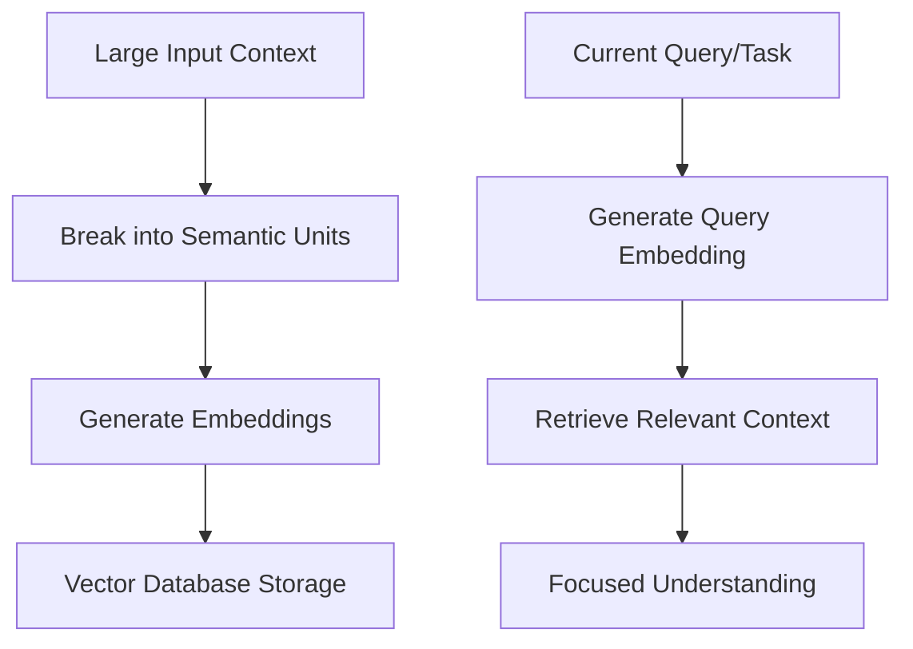
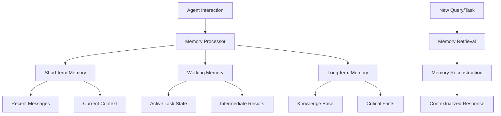
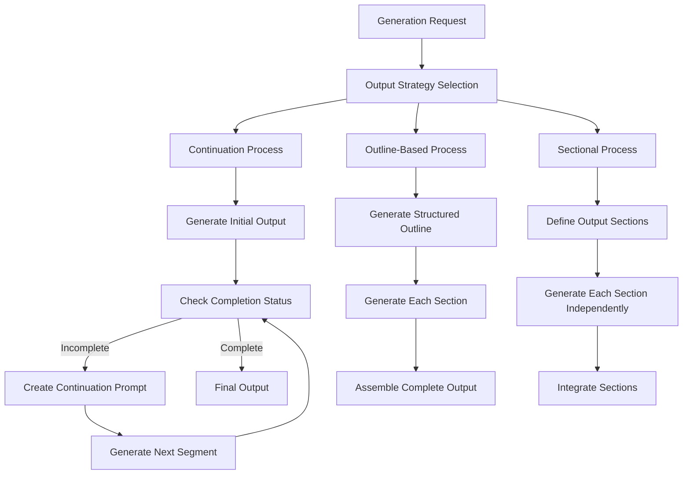
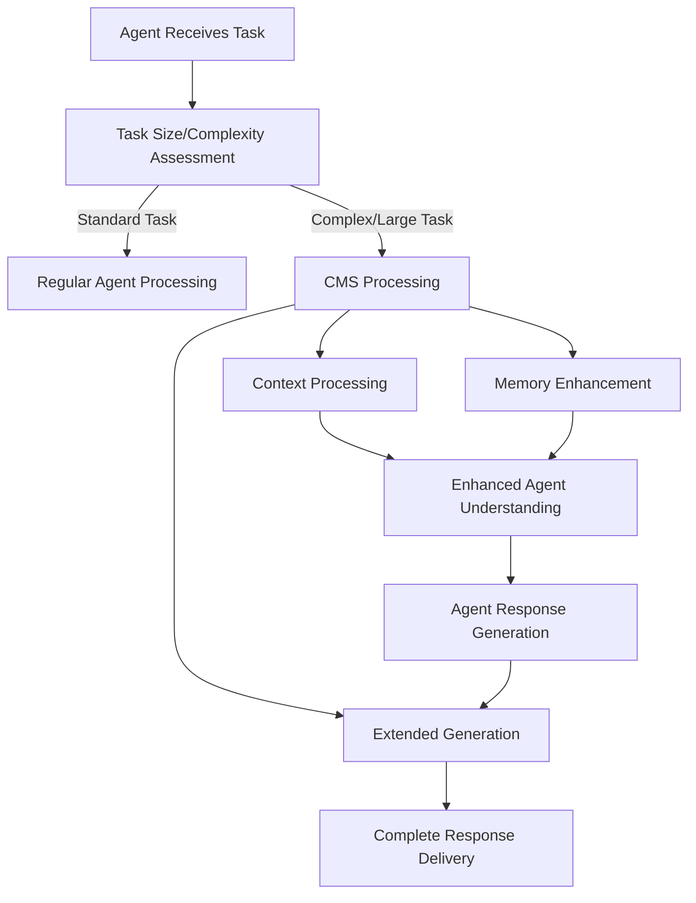
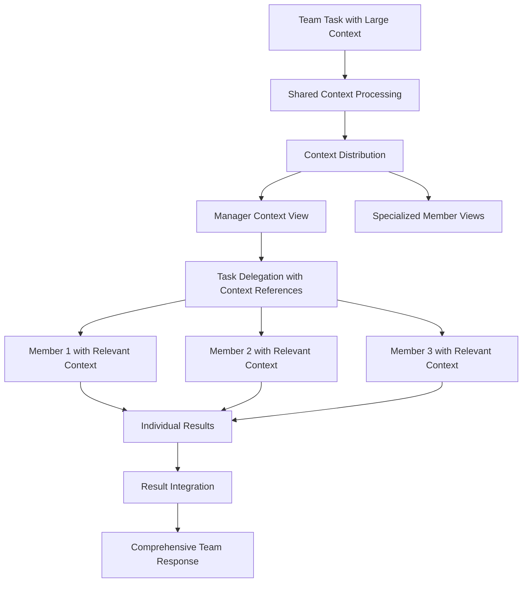
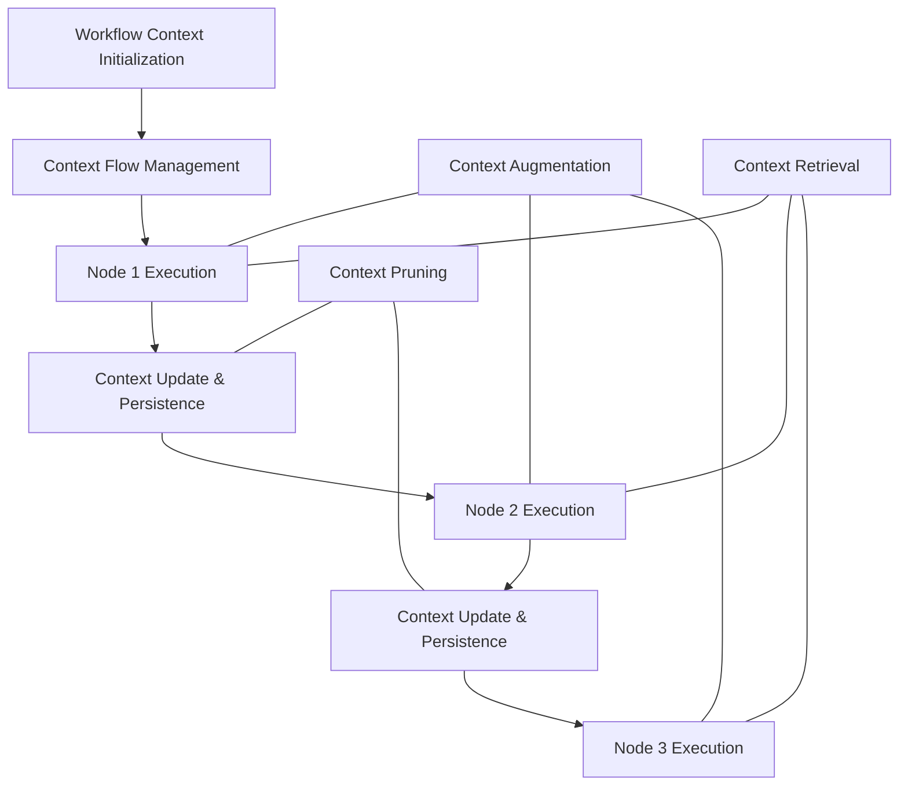
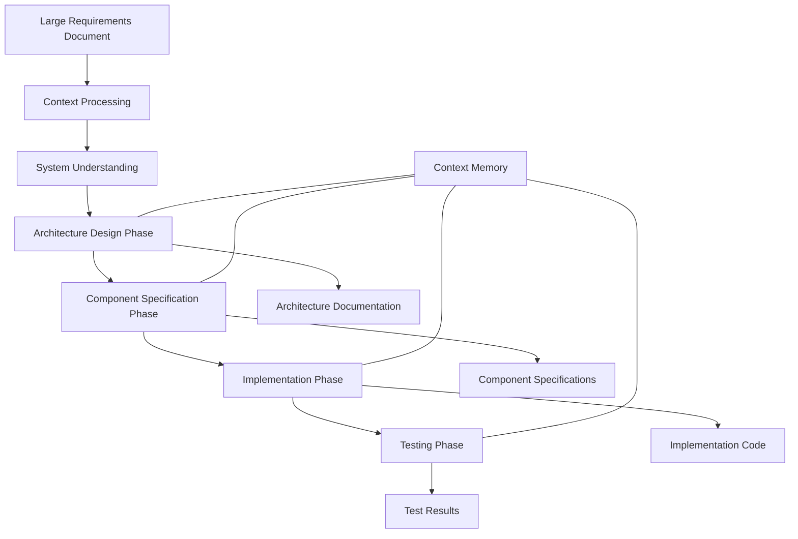
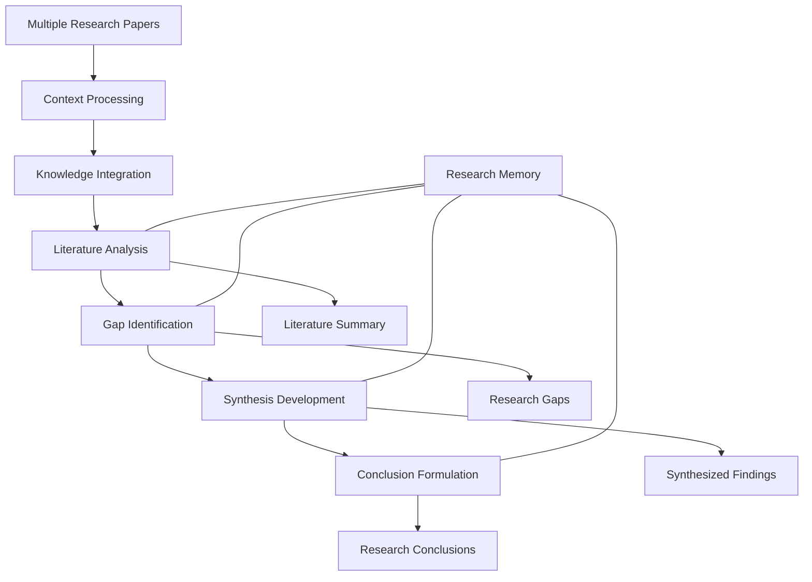

# Enterprise AI: Context Management System (CMS)

## Conceptual Overview

The Context Management System (CMS) would serve as a foundational component of the Enterprise AI platform, addressing the critical challenge of managing, processing, and utilizing large context windows. While the Model Context Protocol (MCP) handles the discovery and execution of tools, the CMS would focus on enabling agents to deeply understand extensive contexts and generate coherent, comprehensive outputs that potentially exceed standard token limitations.

## The Context Management Challenge

### Current Context Limitations

Enterprise AI agents currently face several critical limitations when dealing with large contexts:

1. **Fixed Token Windows**: LLMs are limited to processing a fixed number of tokens at once (typically 8K-100K tokens)
1. **Attention Dilution**: Information spread across a large context can receive less attention from the model
1. **Context Fragmentation**: Breaking large contexts into pieces can lose important connections
1. **Memory Persistence**: Information from earlier interactions is often lost or degraded

### Impact on Agent Capabilities

These limitations directly affect agent performance in several domains:

- **Software Engineering**: Unable to understand large codebases or generate complex, multi-file systems
- **Research Analysis**: Limited ability to synthesize information across multiple documents
- **Strategic Planning**: Difficulty maintaining coherence across complex, multi-step plans
- **Creative Generation**: Challenges in producing long-form, consistent creative content

## Conceptual Architecture

The CMS would be designed as a layer that sits between agents and their underlying LLM providers, managing context processing, memory, and generation:

## Key Processes & Strategies

### 1. Input Context Processing

The process of handling large input contexts through various strategies:

#### Chunking Process

The chunking process works by:

1. Breaking large contexts into manageable pieces with overlap to maintain continuity
1. Processing each chunk to extract essential information
1. Synthesizing the extracted information into a cohesive understanding
1. Enabling the agent to refer back to specific chunks when needed for details

#### Hierarchical Process

The hierarchical process works by:

1. Creating a comprehensive overview of the entire context
1. Identifying and extracting the logical structure and key sections
1. Processing important sections in greater detail
1. Building a mental model that connects the overview with detailed sections
1. Allowing navigation between abstraction levels as needed

#### Retrieval-Based Process

The retrieval process works by:

1. Breaking the context into semantic units (paragraphs, sections, etc.)
1. Converting each unit into a vector embedding that captures its meaning
1. Storing these embeddings in a retrieval system
1. When processing a query or task, retrieving only the most relevant units
1. Focusing attention on the retrieved information for deeper understanding

### 2. Memory Management Process

The process of maintaining different types of information across interactions:

The memory management process:

1. Categorizes information based on relevance and persistence needs
1. Maintains immediate context in short-term memory
1. Tracks task progress and intermediate results in working memory
1. Preserves important facts and knowledge in long-term memory
1. Reconstructs relevant memory when addressing new queries or tasks

### 3. Output Generation Process

The process of generating coherent, extended outputs:

The output generation process:

1. Selects an appropriate strategy based on the output type and length
1. For continuation-based generation:
   - Generates output until a token limit is reached
   - Creates a new prompt that continues from the previous generation
   - Repeats until the complete output is generated
1. For outline-based generation:
   - Creates a structured outline of the entire output
   - Generates each section based on the outline
   - Assembles the sections into a coherent whole
1. For sectional generation:
   - Divides the output into logical sections
   - Generates each section independently
   - Integrates sections with appropriate transitions

## Integration with Enterprise AI Modules

### 1. Agent Integration Concept

The CMS would integrate with the Agent module by:

The integration process would:

1. Automatically detect when a task exceeds standard context capabilities
1. Activate appropriate context management strategies
1. Enhance the agent's memory with processed context
1. Enable extended response generation when needed
1. Preserve the agent's reasoning frameworks and specialization

### 2. Team Integration Concept

The CMS would enable teams to share and collaborate on large contexts:

The team integration would:

1. Process large contexts at the team level
1. Create shared context representations accessible to all team members
1. Allow the manager to delegate tasks with specific context references
1. Enable specialized team members to focus on relevant portions
1. Facilitate result integration that maintains context coherence
1. Support asynchronous access to shared context

### 3. Flow Integration Concept

The Flow integration is particularly important and would maintain context continuity across workflow nodes:

The Flow integration would provide:

#### Context Continuity

- **Workflow Context Object**: A persistent context object that travels between nodes
- **Progressive Enhancement**: Each node contributes to and refines the context
- **Context Versioning**: Maintains versions of context at different workflow stages
- **Dependency Tracking**: Records which context elements are used by which nodes

#### Node-Specific Context Processing

- **Context Relevance Filtering**: Each node receives only relevant portions of the context
- **Context Augmentation**: Nodes can request additional context when needed
- **Local vs. Global Context**: Distinguishes between node-specific and workflow-wide context
- **Context Pruning**: Systematically removes irrelevant context to prevent bloat

#### Workflow Context Management

- **Context State Management**: Tracks the state of the context throughout execution
- **Context Persistence**: Allows pausing and resuming workflows with context intact
- **Context Visualization**: Enables monitoring how context evolves through the workflow
- **Context Debugging**: Identifies issues in context propagation between nodes

This approach ensures that:

1. Large contexts can flow through complex multi-step workflows
1. Each node has access to all necessary context without redundancy
1. Context grows and evolves coherently through the workflow
1. The final output maintains connection to the original input context

## Practical Application Examples

### 1. Engineering Thinking Process

The process would enable:

1. Deep understanding of extensive requirements
1. Maintaining architectural vision throughout implementation
1. Consistent reference to specifications during coding
1. Comprehensive testing that validates against original requirements
1. Long-form code generation with internal consistency

### 2. Research Analysis Process

The process would enable:

1. Comprehensive analysis across multiple documents
1. Identification of connections between separate research papers
1. Synthesis of information that may be distributed across sources
1. Generation of extensive research reports with proper citations
1. Maintenance of academic rigor in long-form analysis

## Implementation Considerations

### Base Model Requirements

The effectiveness of context management depends on the underlying LLM capabilities:

| Capability | Description | Importance |
|------------|-------------|------------|
| Context Window Size | The maximum tokens the model can process | High |
| Attention Mechanism | How effectively the model handles attention across the context | Very High |
| Memory Utilization | How well the model uses provided memory structures | High |
| Reasoning Capability | The model's ability to reason across context elements | Critical |

### Strategy Selection Factors

Different strategies are appropriate for different scenarios:

| Factor | Chunking | Hierarchical | Retrieval |
|--------|----------|--------------|-----------|
| Document Structure | Uniform | Hierarchical | Any |
| Query Specificity | Low | Medium | High |
| Task Type | General | Structured | Targeted |
| Context Size | Medium | Large | Very Large |

### Performance Considerations

Context management introduces performance tradeoffs:

1. **Processing Overhead**: Additional computation for context processing
1. **Memory Requirements**: Increased storage needs for context versions
1. **Latency Impact**: Potential increase in response time
1. **Throughput Reduction**: Fewer concurrent tasks per resource unit

## Limitations and Challenges

Important limitations to consider:

1. **Cognitive Ceiling**: Even with perfect context management, there's a ceiling to what the base model can understand
1. **Coherence Challenges**: Very long outputs may still suffer from coherence issues
1. **Information Prioritization**: Determining what context is most important remains difficult
1. **Context Collapse**: Risk of vital information being lost in extensive contexts

## Conclusion

The Context Management System would significantly enhance the Enterprise AI platform's ability to handle large contexts, enabling deeper understanding and more coherent generation. While not a replacement for strong base model capabilities, it would allow your agents to operate at their maximum potential by overcoming context window limitations.

This system would complement your existing MCP, providing a comprehensive solution for both tool integration and context handling - the two critical dimensions of advanced agent capabilities.
