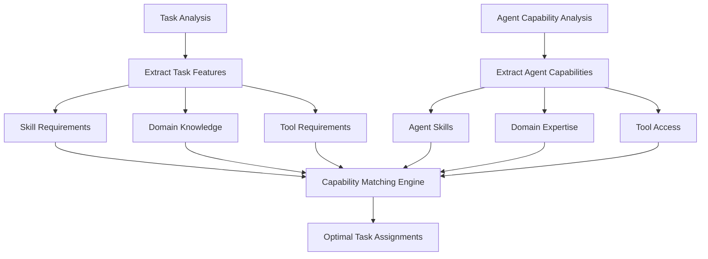
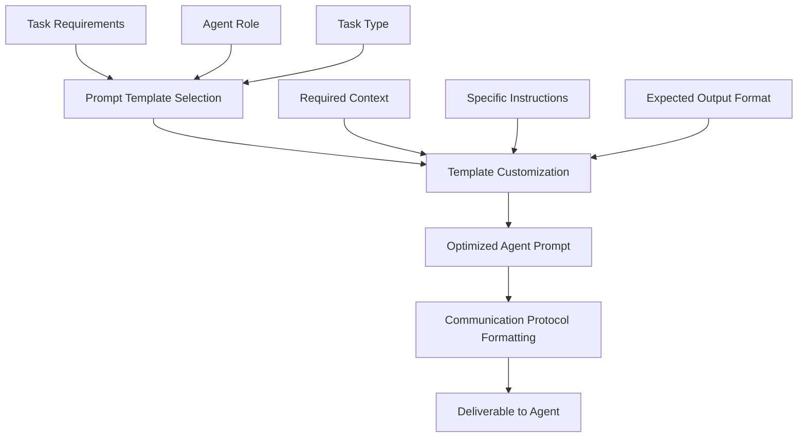

# Task Assignment Tool: Extending Your Planning Capabilities

Yes, creating a specialized tool for task assignment would be an excellent extension of your existing planning tool. This creates a powerful continuum from planning to execution in your agent teams.

## The Planning-to-Assignment Continuum

Your current architecture sets up a natural flow:

```
Planning Tool → Task Assignment Tool → Team Execution
```

Here's how this continuum would work in depth:

### 1. Integration with Existing Planning Tool

Your planning tool likely already performs:

- Task decomposition (breaking large tasks into subtasks)
- Dependency mapping (identifying which tasks depend on others)
- Resource estimation (determining effort requirements)
- Sequence planning (establishing execution order)

The task assignment tool would take this output and add:

- **Agent-Task Matching**: Analyzing which team member is best suited for each subtask
- **Prompt Engineering**: Generating optimized prompts for each agent's specific role
- **Context Packaging**: Including the right amount of context for each subtask
- **Coordination Instructions**: Adding specific guidance on how agents should collaborate

### 2. Advanced Task-Agent Matching

The tool could use several sophisticated approaches to match tasks to agents:



This would use:

- Role definitions from your agent module
- Historical performance data (which agents excel at which tasks)
- Tool access patterns (which agents have access to required tools)
- Workload balancing (distributing tasks appropriately)

### 3. Prompt Structure Generation

The most valuable aspect would be automated generation of well-structured prompts:



The tool would:

- Select appropriate prompt templates based on task and agent type
- Fill in specific details from the planning output
- Structure context in a way that matches the agent's reasoning framework
- Include clear success criteria and output format requirements
- Format everything according to your team communication protocol

### 4. Implementation through MCP

You could implement this as a specialized tool in your MCP system:

```python
class TaskAssignmentTool(BaseTool):
    name = "TaskAssignmentTool"
    description = "Analyzes tasks and team members to create optimized task assignments with structured prompts"

    # Tool parameters would include:
    # - planned_tasks: Output from planning tool
    # - team_id: ID of the team
    # - additional_context: Any extra context for assignments
```

The manager agent would use this tool via MCP:

1. First use the planning tool to create a task breakdown
1. Then use the task assignment tool to match tasks with team members
1. Execute the assignments through the team messaging system
1. Monitor progress and adjust assignments as needed

### 5. Enhanced Coordination Features

The tool could include specialized coordination instructions:

- **Handoff Protocols**: How to pass work between agents
- **Progress Reporting**: How agents should report status
- **Collaboration Points**: When agents should work together
- **Conflict Resolution**: How to resolve conflicting approaches
- **Knowledge Sharing**: How agents should share discoveries

## Benefits Over Manual Assignment

This approach offers significant advantages:

1. **Consistency**: Ensures all assignments follow best practices for prompt structure
1. **Optimization**: Matches tasks to the most suitable agent based on capabilities
1. **Scalability**: Makes it feasible to coordinate larger teams on complex projects
1. **Adaptability**: Can adjust assignments based on progress and intermediate results
1. **Quality**: Improves output by giving each agent precisely what they need to succeed

## Example Workflow in Practice

For a content creation project:

1. **Planning Tool**: Breaks "Create marketing campaign" into subtasks:

   - Market research
   - Target audience analysis
   - Competitive analysis
   - Value proposition development
   - Message creation
   - Channel strategy

1. **Task Assignment Tool**:

   - Matches market research to a researcher agent with browsing tools
   - Matches audience analysis to an analyst agent with data skills
   - Creates structured prompts with proper context for each
   - Adds coordination instructions between related tasks

1. **Team Execution**:

   - Each agent receives an optimized task with proper structure
   - Manager monitors progress through status reports
   - Final outputs are integrated as specified in the assignment plan

This approach would significantly enhance your team's capability to handle complex tasks with minimal manual guidance, allowing the manager agent to focus on oversight rather than detailed task creation.
